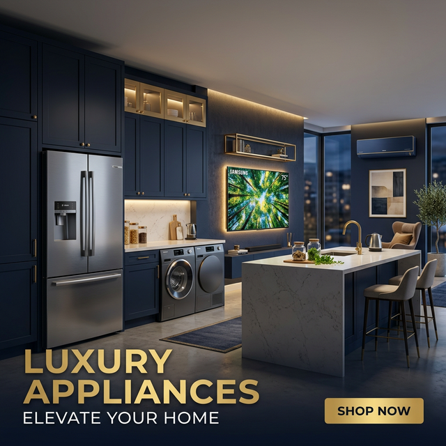

# ⚡ ElectroHogar – Landing Page de Electrodomésticos

Una landing page moderna y premium para un negocio de venta de electrodomésticos. Diseñada con HTML, CSS y JavaScript puro, sin frameworks ni dependencias externas.



---

## 🌐 Demo

Abrí el archivo `index.html` directamente en tu navegador para ver la landing page.

---

## 📋 Secciones

| Sección | Descripción |
|---|---|
| 🔝 **Navbar** | Menú fijo con carrito, navegación y menú mobile |
| 🦸 **Hero** | Banner full-screen con CTA y estadísticas |
| ✅ **Beneficios** | Envío gratis, cuotas, garantía y devoluciones |
| 🛒 **Productos** | Catálogo con filtros por categoría |
| ⏰ **Oferta** | Promo banner con cuenta regresiva en tiempo real |
| 🏷️ **Marcas** | Marquesina animada con marcas líderes |
| ⭐ **Testimonios** | Reseñas de clientes |
| 📩 **Contacto** | Formulario + datos del negocio |
| 🦶 **Footer** | Links, redes sociales e información legal |

---

## 🗂️ Estructura del Proyecto

```
LandingPageElectrodomesticos/
├── index.html               # Estructura principal
├── style.css                # Estilos y diseño
├── script.js                # Interactividad y animaciones
├── hero_banner.png          # Imagen hero
├── product_refrigerator.png # Foto refrigerador
├── product_washing_machine.png # Foto lavarropas
├── product_tv.png           # Foto Smart TV
├── product_ac.png           # Foto aire acondicionado
└── product_microwave.png    # Foto microondas
```

---

## ✨ Funcionalidades

- **Carrito de compras** con contador animado y notificaciones toast
- **Filtros de productos** por categoría (Frío, Lavado, Imagen, Clima, Cocina)
- **Cuenta regresiva** en tiempo real para ofertas
- **Formulario de contacto** con feedback visual
- **Animaciones fade-in** al hacer scroll (Intersection Observer)
- **Navbar scroll effect** con backdrop blur
- **Menú hamburguesa** para dispositivos móviles
- **Scroll to top** button flotante
- **Marquesina** de marcas animada

---

## 🎨 Tecnologías

- **HTML5** semántico
- **CSS3** – Variables CSS, Grid, Flexbox, animaciones, glassmorphism
- **JavaScript ES6+** – Sin librerías externas
- **Google Fonts** – Outfit & Inter
- **Imágenes generadas con IA**

---

## 📱 Responsive

Diseño adaptable a:
- 📱 Mobile (< 540px)
- 📱 Tablet (< 768px)
- 💻 Desktop (1200px+)

---

## 🚀 Cómo usar

1. Cloná el repositorio:
   ```bash
   git clone https://github.com/nillcon07/LandingPageElectrodomesticos_1.git
   ```
2. Abrí `index.html` en tu navegador. ¡Listo!

No requiere instalación de dependencias ni servidor.

---

## 📄 Licencia

MIT – Libre para usar y modificar.
